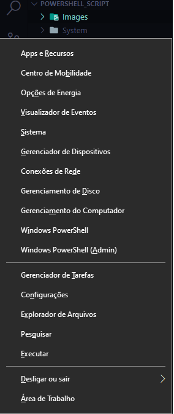

# Utilizando Scripts com Powershell

Para liberar o seu powershell para rodar Scripts você deve fazer o seguinte:

1) Clique <kbd>Windows</kbd> + <kbd>X</kbd> para acessar todas as opções de administrador



2) Clique em **Windows Powershell (Admin)**
3) Coloque o seguinte comando no Powershell:

```powershell
> Set-ExecutionPolicy RemoteSigned
```

Agora podemos rodar os Script no Powershell!

Os Scripts de Powershell tem a extensão `.ps1` e para rodar somente chamamos no Powershell como Shell Script:

```powershell
> .\script.ps1
```

---

## Lista de Scripts e suas funções

Nome do Script|Diretório|Para que serve
|---|---|---|
*ram_info.ps1*|System|Verificar a quantidade de RAM do Computador
*running_programs.ps1*|System|Verifica quais programas estão rodando no momento
*get_disk_info.ps1*|System|Verifica as informações do HD e SSD do computador
*computer_info.ps1*|System|Mostra todas as informações sobre o computador


